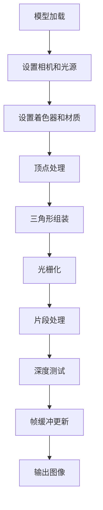

# SoftRasterizer 渲染流程解析

## 概述
本文档详细分析 SoftRasterizer 的渲染管线实现，涵盖从模型加载到最终像素输出的完整流程。渲染管线主要分为初始化阶段和每帧渲染阶段。

## 核心渲染流程

### 1. 初始化阶段
```cpp
// main.cpp 中的初始化代码
Framebuffer framebuffer(width, height);
Model model;
model.loadFromObj("resources/obj/african_head.obj");
model.loadDiffuseTexture("resources/diffuse/african_head_diffuse.tga");

Camera camera(Vector3<float>(0, 1, 3), Vector3<float>(0, 0, 0), Vector3<float>(0, 1, 0));
camera.setPerspective(45.0f, aspectRatio, near, far);

Renderer renderer(framebuffer, camera);
std::vector<Light> lights;
// 设置光源...
auto shader = std::make_shared<BlinnPhongShader>();
renderer.setShader(shader);
```

### 2. 每帧渲染阶段

#### 2.1 设置Uniform变量
```cpp
// renderer.cpp - drawModel()
currentShader->uniform_ModelMatrix = modelMatrix;
currentShader->uniform_ViewMatrix = viewMatrix; 
currentShader->uniform_ProjectionMatrix = projectionMatrix;
currentShader->uniform_MVP = projectionMatrix * viewMatrix * modelMatrix;
currentShader->uniform_NormalMatrix = modelMatrix.inverse().transpose();
currentShader->uniform_CameraPosition = cameraPosition;
currentShader->uniform_Lights = lights;
currentShader->uniform_Material = material;
```

#### 2.2 顶点处理
```cpp
// shader.h
virtual Varyings vertex(const VertexInput& input) = 0;

// 顶点着色器处理流程：
// 1. 将顶点位置变换到世界空间
// 2. 变换法线到世界空间
// 3. 计算裁剪空间位置
// 4. 传递UV等属性
```

#### 2.3 三角形组装与光栅化
```cpp
// renderer.cpp
// 1. 背面剔除
float signedArea = (p1.x - p0.x) * (p2.y - p0.y) - (p2.x - p0.x) * (p1.y - p0.y);
if (signedArea < 0) continue;

// 2. 扫描线光栅化
for (int y = yStart; y <= yEnd; ++y) {
    // 沿三角形两边插值
    // 在扫描线内插值片段属性
    // 深度测试
    if (depth >= framebuffer.getDepth(x, y)) continue;
}
```

#### 2.4 片段处理
```cpp
// shader.h 
virtual bool fragment(const Varyings& input, Vector3<float>& outColor) = 0;

// 片段着色器处理流程：
// 1. 标准化法线和视线方向
// 2. 采样纹理(如果有)
// 3. 计算光照(漫反射+高光)
// 4. 输出最终颜色
```

#### 2.5 帧缓冲更新
```cpp
framebuffer.setPixel(x, y, fragmentColor, depth);
```

## 关键技术点

### 1. 透视校正插值
```cpp
Varyings Renderer::interpolateVaryings(float t, const Varyings& start, 
                                     const Varyings& end, float startInvW, float endInvW) {
    // 使用1/w进行透视校正插值
    float currentInvW = startInvW + (endInvW - startInvW) * t;
    float currentW = 1.0f / currentInvW;
    // 对每个属性进行插值
}
```

### 2. 深度缓冲
```cpp
// 深度值映射到[0,1]范围
screenVertices[j].z = (ndcPos.z + 1.0f) * 0.5f; 

// 深度测试
if (depth >= framebuffer.getDepth(x, y)) continue;
```

### 3. 光照计算优化
```cpp
// 使用快速幂算法优化高光计算
template <typename T>
T fastPow(T base, int n) {
    T res = static_cast<T>(1);
    while (n) {
        if (n & 1) res = res * base;
        base = base * base;
        n >>= 1;
    }
    return res;
}
```

## 渲染管线图示



## 性能优化

1. **提前深度测试**：在片段着色器前进行深度测试
2. **背面剔除**：减少约50%的三角形处理
3. **快速幂算法**：优化高光计算
4. **透视校正插值**：保证纹理和属性正确插值

## 后续改进计划

1. 实现法线贴图支持
2. 添加阴影计算
3. 支持延迟渲染管线
4. 实现多线程渲染
